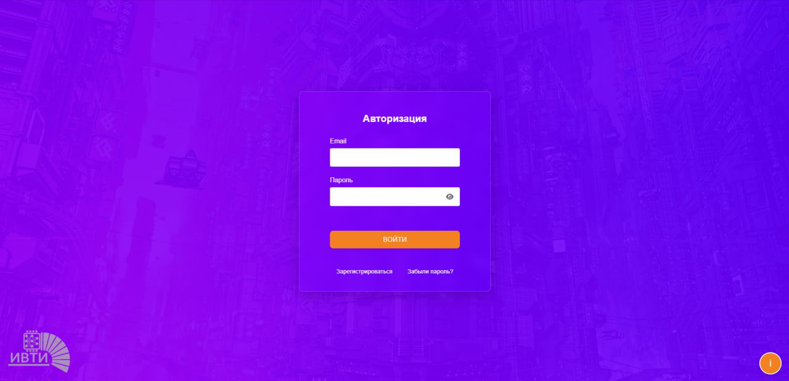
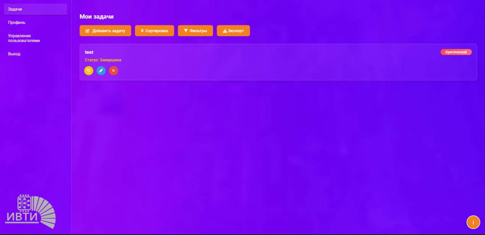
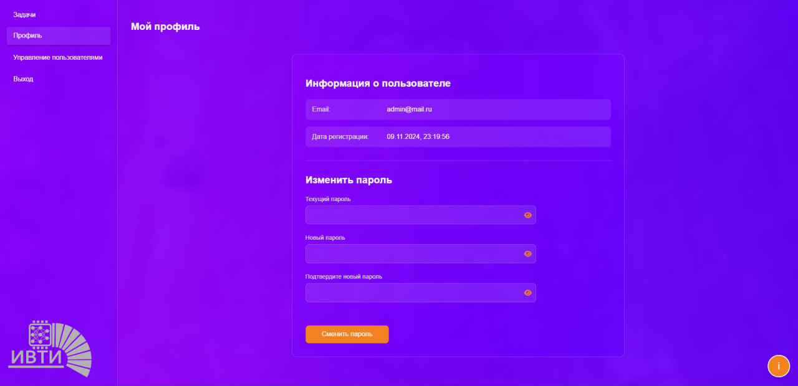
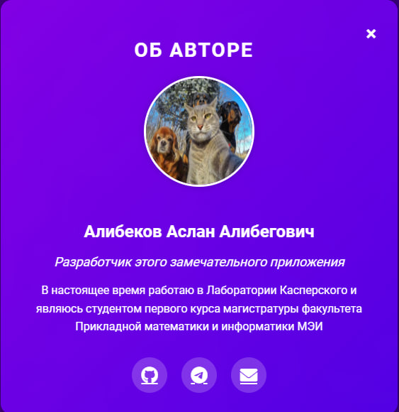
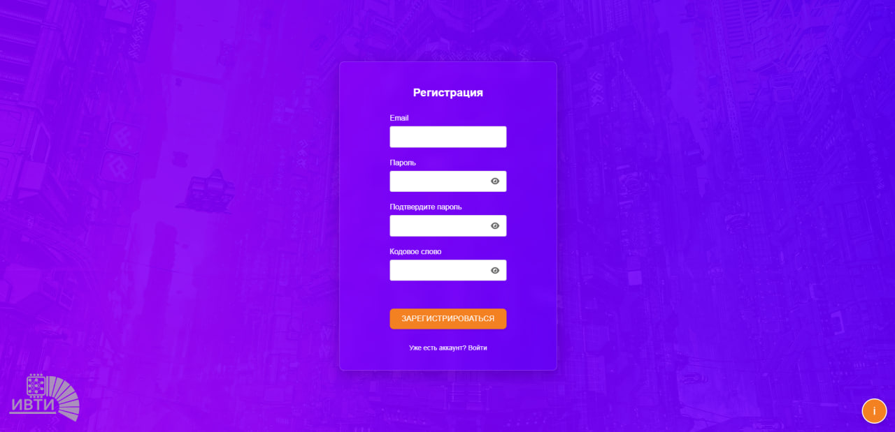
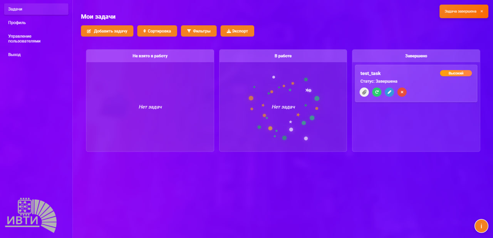
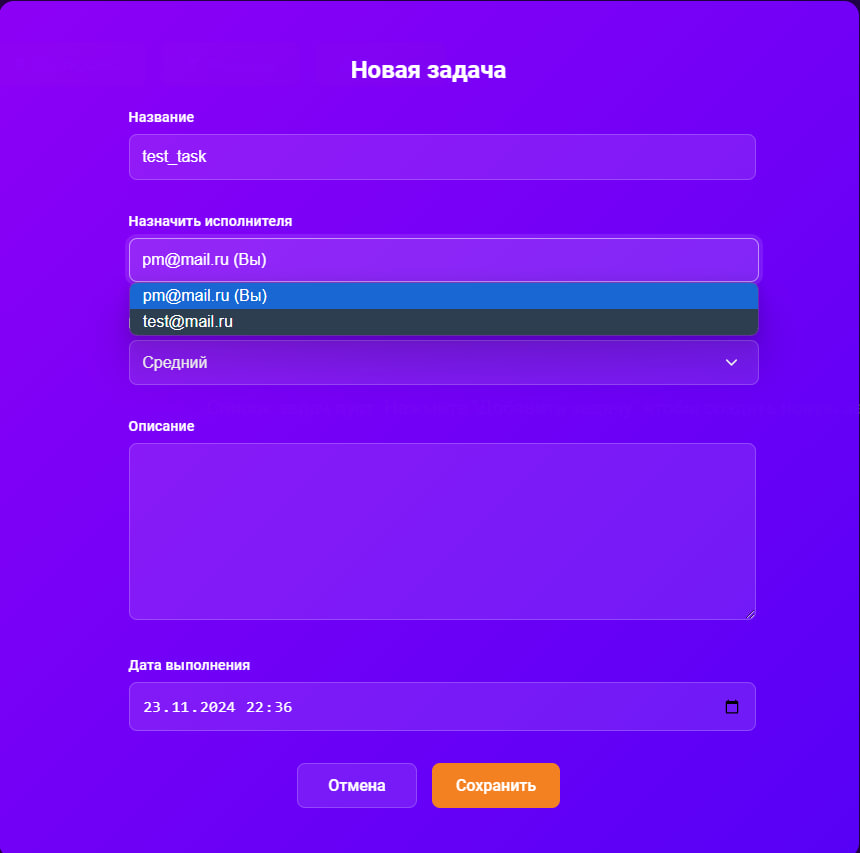
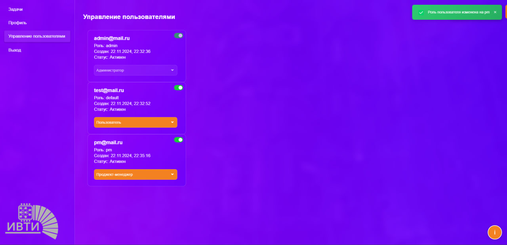
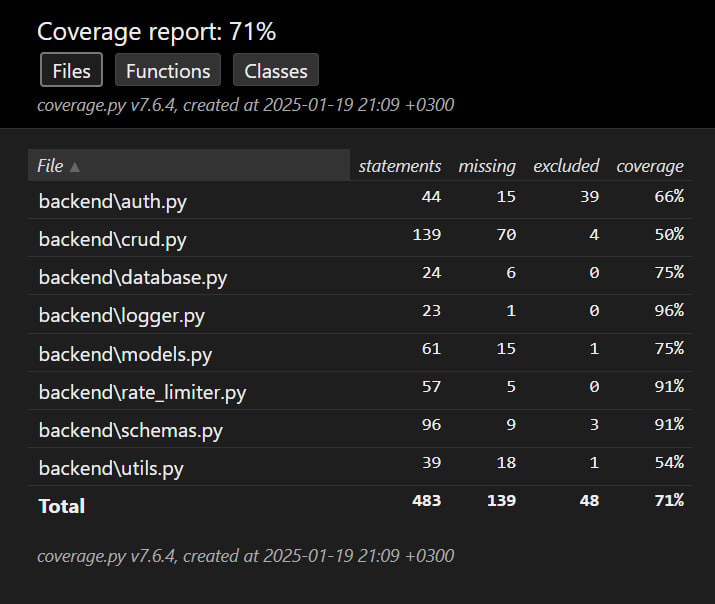

# 🚀 Task Manager Pro

Современное веб-приложение для управления задачами с визуализацией дедлайнов и системой уведомлений.


## 📋 Содержание

- [Особенности](#особенности)
- [Технологии](#технологии)
- [Автор](#автор)
- [Примеры](#примеры)
- [Тесты](#тесты)
- [Запуск тестов](#запуск-тестов)
- [Запуск сервера](#запуск-сервера)

## ✨ Особенности

- 🔐 Безопасная аутентификация и авторизация с использованием JWT
- 📝 Полный CRUD для управления задачами
- ⏰ Визуализация дедлайнов с анимированным "горящим фитилем"
- 🔔 Умная система уведомлений о приближающихся дедлайнах
- 👤 Управление профилем пользователя
- 🎨 Современный и отзывчивый интерфейс

## 🛠 Технологии

### Backend
- **FastAPI** - современный асинхронный веб-фреймворк
- **SQLAlchemy** - мощный ORM для работы с базой данных
- **Pydantic** - валидация данных и сериализация
- **JWT** - безопасная аутентификация
- **Bcrypt** - надежное хеширование паролей
- **SQLite** - легкая и быстрая база данных

### Frontend
- **HTML5/CSS3** - современная семантическая верстка
- **JavaScript (ES6+)** - чистый JS без фреймворков
- **CSS Animations** - плавные анимации и визуальные эффекты
- **Responsive Design** - адаптивная верстка

## 👥 Автор

- [AlibekovAA](https://github.com/AlibekovAA)

## 📄 Примеры











## 🧪 Тесты


## Запуск тестов
- Базовый отчет в консоли:
  - pytest --cov=backend tests/
- Более детальный HTML-отчет:
  - pytest --cov=backend --cov-report=html tests/
  - Откройте htmlcov/index.html в браузере для просмотра детального отчета.

## Запуск приложения

### Через Docker Compose (рекомендуется)
1. Убедитесь, что у вас установлены Docker и Docker Compose
2. Клонируйте репозиторий:
   ```bash
   git clone https://github.com/AlibekovAA/task_manager.git
   cd task_manager
   ```
3. Запустите приложение:
   ```bash
   docker-compose up --build
   ```
4. Откройте браузер и перейдите по адресу: http://127.0.0.1:8000

### Локальный запуск
1. Установите зависимости:
   ```bash
   pip install -r requirements.txt
   ```
2. Запустите сервер:
   ```bash
   uvicorn main:app --reload
   ```
3. Откройте браузер и перейдите по адресу: http://127.0.0.1:8000

---
⭐️ Star на GitHub — это помогает!
