# Task Manager Pro

Профессиональная система управления проектами и задачами с гибкой системой ролей, распределением задач между командой и полным контролем над рабочими процессами.

## Основной функционал

### Управление задачами

- **Полный CRUD** для задач с поддержкой приоритетов (1-4) и статусов (Proposed, In Progress, Complete)
- **Назначение задач** пользователям с возможностью перераспределения
- **Дедлайны** с визуализацией и умными уведомлениями о приближающихся сроках
- **Прикрепление файлов** к задачам с валидацией типа и размера
- **Отслеживание прогресса** с фильтрацией по статусу, приоритету и дедлайну

### Система ролей и прав доступа

**Default (Обычный пользователь)**

- Создание и управление собственными задачами
- Просмотр назначенных задач
- Управление профилем и смена пароля

**PM (Project Manager)**

- Все возможности обычного пользователя
- Создание задач и назначение их другим пользователям
- Перераспределение задач между членами команды
- Управление назначенными задачами (редактирование, удаление)
- Просмотр всех назначенных задач

**Admin (Администратор)**

- Полный доступ ко всем функциям системы
- Управление пользователями (создание, редактирование, блокировка/разблокировка)
- Изменение ролей пользователей
- Просмотр всех задач в системе
- Административная панель с полной статистикой

### Безопасность

- JWT-аутентификация с refresh токенами
- Rate limiting для защиты от brute-force атак
- Хеширование паролей с использованием Bcrypt
- Восстановление пароля через секретное слово
- Разграничение доступа на основе ролей

## Содержание

- [Клиент-серверная архитектура](#архитектура)
- [Технологии](#технологии)
- [Примеры](#примеры)
- [Быстрый старт с Makefile](#быстрый-старт-с-makefile)
- [Тесты](#тесты)
- [Запуск тестов](#запуск-тестов)
- [Запуск сервера](#запуск-сервера)

## Архитектура

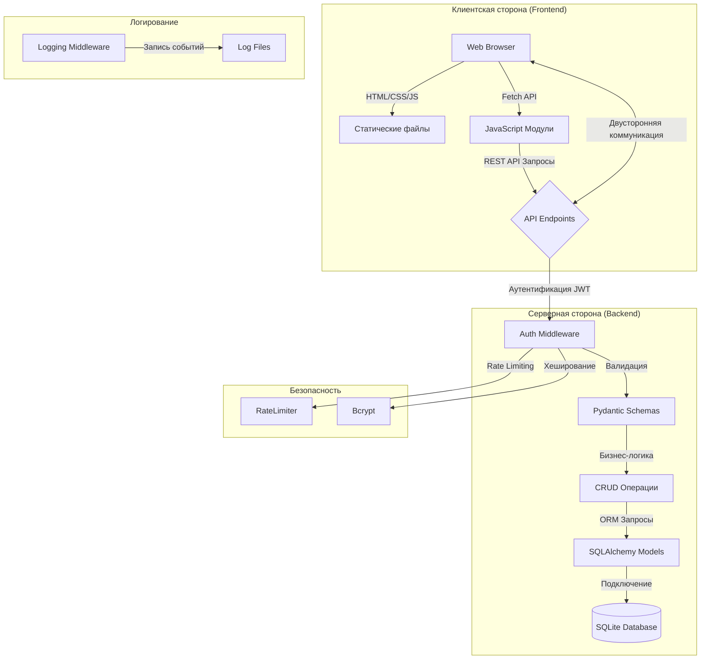
```mermaid
graph TD
    subgraph "Клиентская сторона (Frontend)"
        A[Web Browser] --> |HTML/CSS/JS| B[Статические файлы]
        A --> |Fetch API| C[JavaScript Модули]
        C --> |REST API Запросы| D{API Endpoints}
    end

    subgraph "Серверная сторона (Backend)"
        D --> |Аутентификация JWT| E[Auth Middleware]
        E --> |Валидация| F[Pydantic Schemas]
        F --> |Бизнес-логика| G[CRUD Операции]
        G --> |ORM Запросы| H[SQLAlchemy Models]
        H --> |Подключение| I[(SQLite Database)]
    end

    subgraph "Безопасность"
        E --> |Rate Limiting| J[RateLimiter]
        E --> |Хеширование| K[Bcrypt]
    end

    subgraph "Логирование"
        L[Logging Middleware] --> |Запись событий| M[Log Files]
    end

    A <--> |Двусторонняя коммуникация| D
```

## Технологии

### Backend

- **FastAPI** - современный асинхронный веб-фреймворк
- **SQLAlchemy** - мощный ORM для работы с базой данных
- **Pydantic** - валидация данных и сериализация
- **JWT** - безопасная аутентификация
- **Bcrypt** - надежное хеширование паролей
- **SQLite** - легкая и быстрая база данных

### Frontend

- **HTML5/CSS3** - современная семантическая верстка
- **JavaScript (ES6+)** - чистый JS без фреймворков
- **CSS Animations** - плавные анимации и визуальные эффекты
- **Responsive Design** - адаптивная верстка

### Инструменты разработки

- **Makefile** - автоматизация задач разработки (Docker, тесты, очистка)
- **Docker Compose** - контейнеризация приложения
- **pytest** - тестирование с покрытием кода

## Примеры

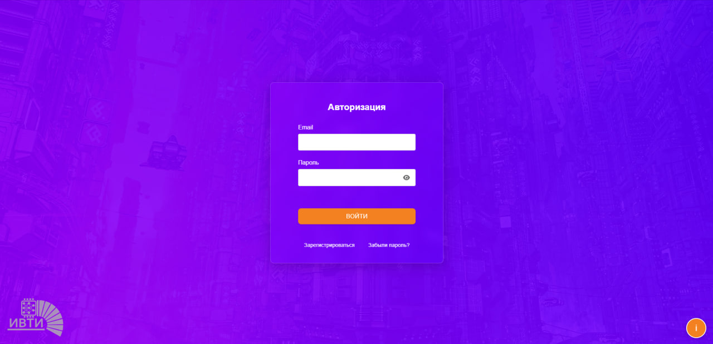
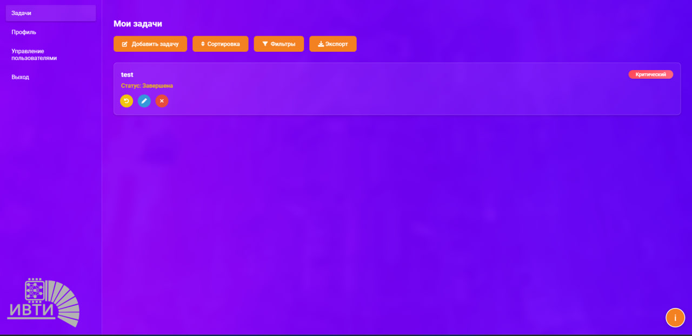
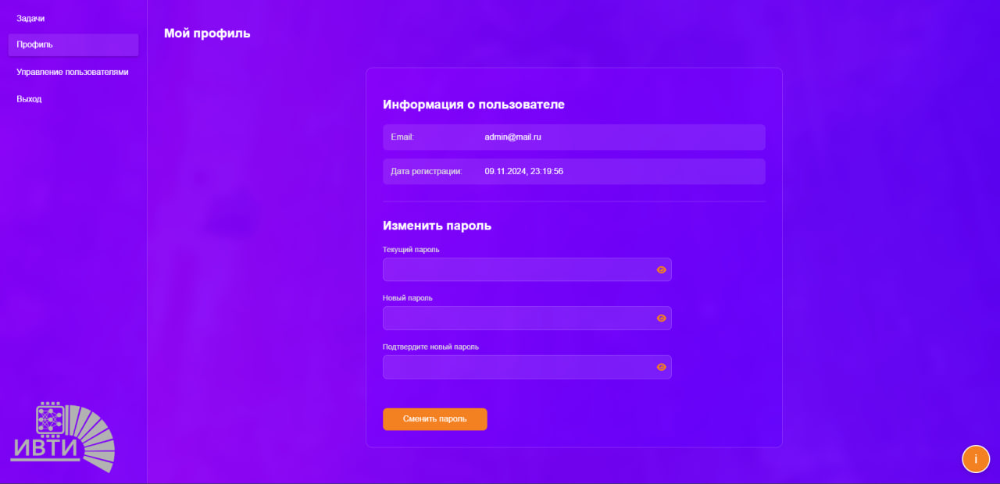
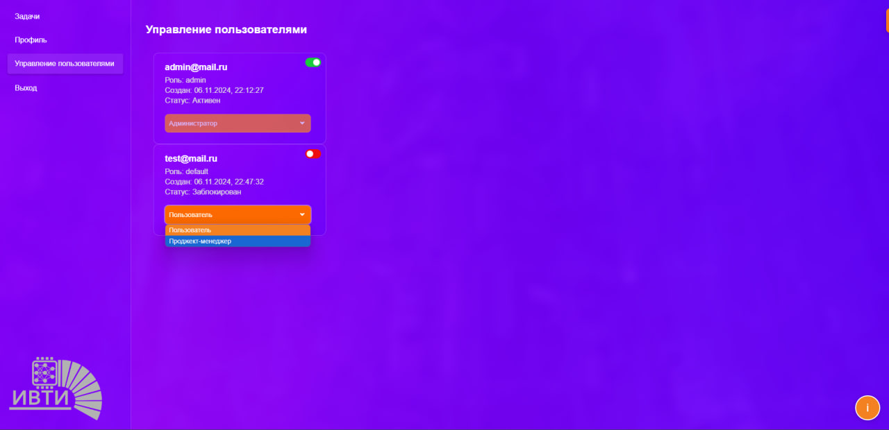
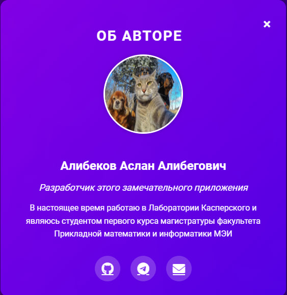
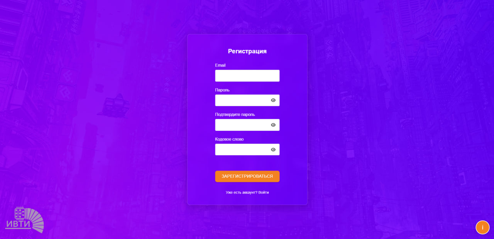
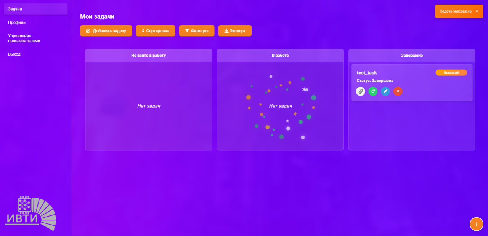
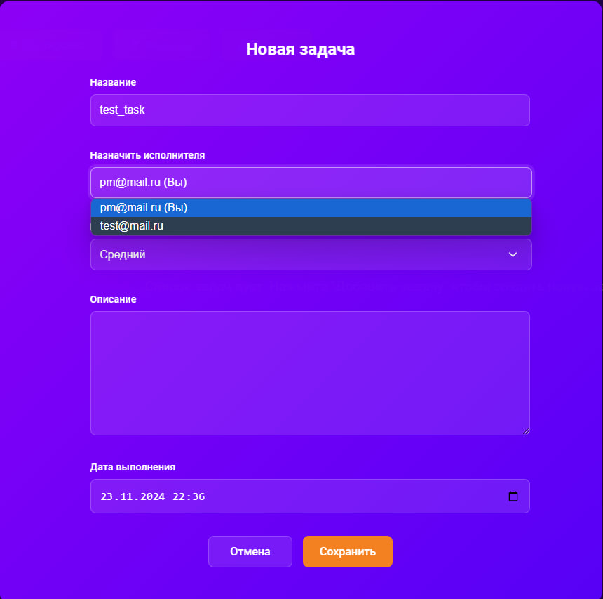
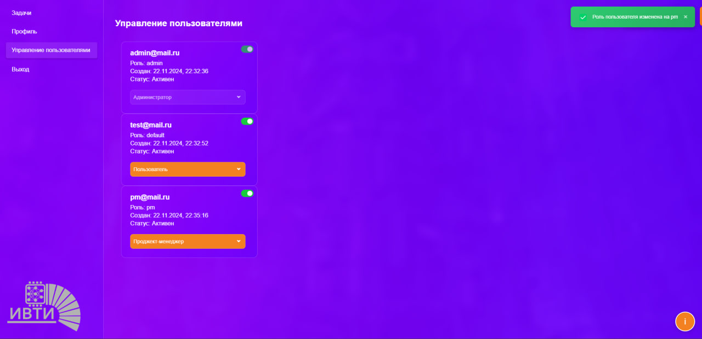

## Быстрый старт с Makefile

Проект включает Makefile для упрощения работы с приложением. Все команды доступны через `make`:

### Основные команды

```bash
# Показать справку по всем доступным командам
make help

# Запустить приложение через Docker Compose
make up
# или
make start

# Остановить контейнеры
make down
# или
make stop

# Перезапустить контейнеры
make restart

# Пересобрать и запустить контейнеры
make rebuild

# Запустить тесты с покрытием кода
make test

# Очистить кэш, логи и временные файлы
make clean

# Показать логи контейнеров
make logs
```

## Тесты

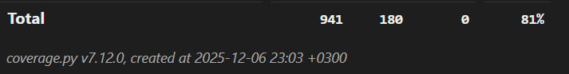

## Запуск тестов

### Через Makefile (рекомендуется)

```bash
make test
```

### Вручную

- Базовый отчет в консоли:
  ```bash
  pytest --cov=backend --cov-report=term-missing tests/
  ```
- Более детальный HTML-отчет:
  ```bash
  pytest --cov=backend --cov-report=html tests/
  ```
  Откройте `htmlcov/index.html` в браузере для просмотра детального отчета.

## Запуск приложения

### Через Makefile (рекомендуется)

1. Убедитесь, что у вас установлены Docker и Docker Compose
2. Клонируйте репозиторий:
   ```bash
   git clone https://github.com/AlibekovAA/task_manager.git
   cd task_manager
   ```
3. Запустите приложение:
   ```bash
   make up
   # или для пересборки
   make rebuild
   ```
4. Откройте браузер и перейдите по адресу: http://127.0.0.1:8000

**Дополнительные команды:**

- Остановить: `make down`
- Перезапустить: `make restart`
- Просмотр логов: `make logs`

### Через Docker Compose напрямую

1. Убедитесь, что у вас установлены Docker и Docker Compose
2. Клонируйте репозиторий:
   ```bash
   git clone https://github.com/AlibekovAA/task_manager.git
   cd task_manager
   ```
3. Запустите приложение:
   ```bash
   docker-compose up --build
   ```
4. Откройте браузер и перейдите по адресу: http://127.0.0.1:8000

### Локальный запуск

1. Установите зависимости:
   ```bash
   pip install -r requirements.txt
   ```
2. Запустите сервер:
   ```bash
   uvicorn main:app --reload
   ```
3. Откройте браузер и перейдите по адресу: http://127.0.0.1:8000

---
